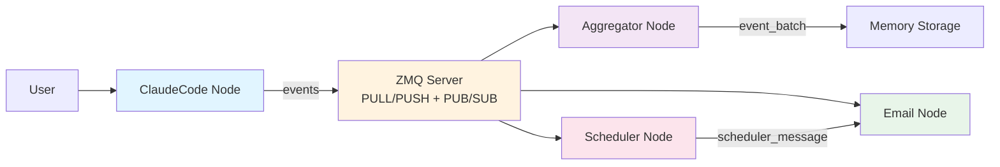

# Mosaic

An event-driven distributed multi-agent system framework for orchestrating AI agents through a flexible event mesh architecture.

[中文文档](./README_CN.md)

## What is Mosaic?

Mosaic is an **Event Mesh System** that enables multiple specialized nodes (AI assistants, email handlers, schedulers, etc.) to collaborate seamlessly through event-driven communication. Instead of building monolithic AI applications, Mosaic lets you compose independent agents that communicate via a publish-subscribe event network.

Think of it as a **nervous system for AI agents** - each node specializes in specific tasks, and they coordinate through structured events flowing across a ZeroMQ-based message bus.

### Why Mosaic?

- **Decoupled Architecture**: Nodes communicate through events, not direct calls - easy to extend and maintain
- **AI-Native**: Claude AI can proactively orchestrate other nodes through MCP tools
- **Flexible Routing**: Dynamic event subscriptions allow complex workflows without hardcoding dependencies
- **Session Management**: Isolated execution contexts with automatic event propagation
- **Lightweight**: Built on ZeroMQ and SQLite - no heavy infrastructure required

## Core Features

- **Event-Driven Communication**: All inter-node communication happens through typed events (11 built-in event types)
- **Multi-Agent Collaboration**: Multiple Claude instances and specialized nodes can work together
- **Dynamic Topology**: Add, remove, or reconfigure nodes and subscriptions at runtime
- **MCP Integration**: Claude agents can call other nodes via Model Context Protocol tools
- **Session Mirroring**: Upstream sessions can automatically propagate to downstream nodes
- **Built-in Nodes**: ClaudeCode (AI assistant), Aggregator (event collector), Email (mail handler), Scheduler (cron jobs)

## Architecture Overview



### How It Works

1. **Nodes** are independent processes that can send and receive events
2. **Events** are typed messages (e.g., `session_start`, `user_prompt_submit`, `node_message`)
3. **Subscriptions** define which nodes receive which event types from other nodes
4. **Sessions** provide isolated execution contexts with automatic event routing
5. **ZMQ Server** acts as a central message broker for all nodes

## Prerequisites

- **Claude Code** access - This framework is designed to work with Claude Code nodes as the primary AI agent interface
- Python 3.13 or higher
- `uv` (recommended) or `pip` for dependency management

## Installation

### 1. Clone the Repository

```bash
git clone <repository-url>
cd mosaic
```

### 2. Install Dependencies

Using `uv` (recommended):

```bash
uv sync
```

Or using `pip`:

```bash
pip install -e .
```

### 3. Initialize Mosaic

```bash
mosaic init
```

This creates the SQLite database and sets up the initial configuration.

## Quick Start

### Step 1: Start the Mosaic Server

```bash
mosaic start-server
```

This starts the ZeroMQ server (default ports: PULL 5555, PUSH 5556, PUB 5557, SUB 5558).

### Step 2: Create Your First Node

Create a Claude Code node:

```bash
mosaic node create my-agent --type cc
```

Create an aggregator to collect events:

```bash
mosaic node create my-aggregator --type aggregator
```

### Step 3: Set Up Event Subscriptions

Let the aggregator collect events from your Claude node:

```bash
mosaic sub create my-agent my-aggregator --event-types session_start session_response user_prompt_submit
```

### Step 4: Start the Nodes

```bash
mosaic node start my-agent
mosaic node start my-aggregator
```

### Step 5: Interact with Your Agent

```bash
mosaic node chat my-agent
```

Your messages and the agent's responses will automatically be sent to the aggregator node!

### Step 6: View Topology

See how your nodes are connected:

```bash
mosaic node topology
```

## Core Concepts

### Event Mesh

An **Event Mesh** is a publish-subscribe network where nodes communicate by emitting and subscribing to typed events. Unlike traditional request-response APIs, events flow asynchronously through the mesh based on subscription rules.

### Node

A **Node** is an independent process in the Mosaic system. Each node:
- Has a unique ID
- Can emit events
- Can subscribe to events from other nodes
- Manages its own sessions

**Built-in Node Types:**
- `cc` (ClaudeCode): AI assistant powered by Claude
- `aggregator`: Collects and batches events
- `email`: Monitors and sends emails
- `scheduler`: Triggers events based on cron schedules

### Event

An **Event** is a structured message sent between nodes. Every event has:
- `event_id`: Unique identifier
- `event_type`: One of 11 predefined types
- `source_id`: Node that emitted the event
- `target_id`: Intended recipient (or broadcast)
- `session_id`: Associated session
- `payload`: Event-specific data
- `timestamp`: When the event occurred

**Core Event Types:**
- `session_start` - A session has begun
- `session_end` - A session has ended
- `session_response` - AI assistant response
- `user_prompt_submit` - User input received
- `pre_tool_use` / `post_tool_use` - Tool execution hooks
- `node_message` - Generic inter-node message
- `event_batch` - Aggregated events
- `email_message` - Email-related events
- `scheduler_message` - Scheduled task triggers

### Session

A **Session** represents an isolated execution context within a node. Sessions:
- Have unique IDs
- Can mirror upstream sessions (via `session_alignment: mirroring`)
- Automatically route events to subscribed nodes
- Support lifecycle events (`session_start`, `session_end`)

### Subscription

A **Subscription** defines an event flow from one node to another:

```
Source Node --[event_types]--> Target Node
```

Example: "Send all `session_response` events from `my-agent` to `my-aggregator`"

## Built-in Node Types

### ClaudeCode Node (`cc`)

An AI assistant node powered by Claude Code. Features:
- Interactive chat interface
- Programmatic mode for automation
- MCP tool integration (can call other nodes via `send_message`, `send_email`)
- Dynamic system prompts with network topology awareness
- Session mirroring support

**Usage:**
```bash
mosaic node create my-assistant --type cc
mosaic node chat my-assistant
```

### Aggregator Node

Collects events from multiple sources and batches them for storage or processing.

**Usage:**
```bash
mosaic node create logger --type aggregator
mosaic sub create source-node logger --event-types session_response user_prompt_submit
```

### Email Node

Monitors email inboxes and can send emails based on received events.

**Configuration:**
```bash
mosaic node create mailer --type email --config email=user@example.com
```

### Scheduler Node

Triggers events based on cron schedules.

**Configuration:**
```bash
mosaic node create daily-task --type scheduler --config cron="0 9 * * *"
```

## Usage Examples

### Example 1: Automatic Email Reports

Set up a Claude agent that sends daily email summaries:

```bash
# Create nodes
mosaic node create analyst --type cc
mosaic node create mailer --type email --config email=you@example.com
mosaic node create daily-trigger --type scheduler --config cron="0 17 * * *"

# Set up event flow
mosaic sub create daily-trigger analyst --event-types scheduler_message
mosaic sub create analyst mailer --event-types node_message

# Start all nodes
mosaic node start analyst
mosaic node start mailer
mosaic node start daily-trigger
```

Now at 5 PM daily, the scheduler triggers the analyst, which can send reports via the mailer.

### Example 2: Multi-Agent Collaboration

Two Claude agents working together:

```bash
# Create two agents
mosaic node create researcher --type cc
mosaic node create writer --type cc

# Let them communicate
mosaic sub create researcher writer --event-types node_message
mosaic sub create writer researcher --event-types node_message

# Start both
mosaic node start researcher
mosaic node start writer
```

The researcher can send messages to the writer using the `send_message` MCP tool.

### Example 3: Event Monitoring

Monitor all activity across your mesh:

```bash
# Create aggregator
mosaic node create monitor --type aggregator

# Subscribe to all events from all nodes
mosaic sub create node-1 monitor --event-types session_start session_end session_response
mosaic sub create node-2 monitor --event-types session_start session_end session_response

# Start monitoring
mosaic node start monitor
```

## CLI Reference

### Server Management

```bash
mosaic init                    # Initialize database
mosaic start-server            # Start ZMQ server
mosaic reset                   # Reset all data
```

### Node Management

```bash
mosaic node create <id> --type <cc|aggregator|email|scheduler>
mosaic node list               # List all nodes
mosaic node show <id>          # Show node details
mosaic node topology           # Show network topology
mosaic node start <id>         # Start a node
mosaic node stop <id>          # Stop a node
mosaic node restart <id>       # Restart a node
mosaic node delete <id>        # Delete a node
mosaic node chat <id>          # Chat with a node (cc only)
mosaic node program <id>       # Programmatic mode (cc only)
```

### Subscription Management

```bash
mosaic sub create <source> <target> --event-types <type1> <type2> ...
mosaic sub delete <source> <target> --event-types <type1> ...
```

### Advanced Node Operations

```bash
mosaic node connect <source> <target>          # Direct connection
mosaic node disconnect <source> <target>       # Remove connection
mosaic node add-mcp-server <id> <server-name>  # Add MCP server to node
mosaic node set-model <id> <model>             # Set Claude model
mosaic node send-event <id> <event-type>       # Manually send event
```

## License

[Specify your license here]
