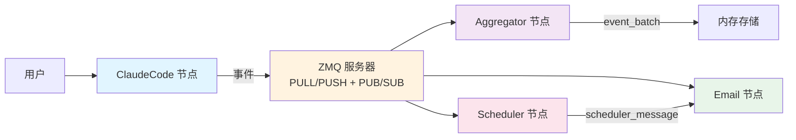

# Mosaic

一个事件驱动的分布式多智能体系统框架，通过灵活的事件网格架构编排 AI 智能体。

[English Documentation](./README.md)

## Mosaic 是什么？

Mosaic 是一个**事件网格系统（Event Mesh System）**，它使多个专门化的节点（AI 助手、邮件处理器、调度器等）能够通过事件驱动的通信无缝协作。与构建单体 AI 应用不同，Mosaic 让你可以组合独立的智能体，它们通过基于 ZeroMQ 的发布-订阅事件网络进行通信。

可以把它想象成 **AI 智能体的神经系统** - 每个节点专注于特定任务，通过流经消息总线的结构化事件进行协调。

### 为什么选择 Mosaic？

- **解耦架构**：节点通过事件通信，而非直接调用 - 易于扩展和维护
- **AI 原生**：Claude AI 可以通过 MCP 工具主动编排其他节点
- **灵活路由**：动态事件订阅允许构建复杂工作流，无需硬编码依赖关系
- **会话管理**：隔离的执行上下文，自动进行事件传播
- **轻量级**：基于 ZeroMQ 和 SQLite - 无需重型基础设施

## 核心特性

- **事件驱动通信**：所有节点间通信都通过类型化事件进行（11 种内置事件类型）
- **多智能体协作**：多个 Claude 实例和专门化节点可以协同工作
- **动态拓扑**：运行时添加、删除或重新配置节点和订阅
- **MCP 集成**：Claude 智能体可以通过模型上下文协议工具调用其他节点
- **会话镜像**：上游会话可以自动传播到下游节点
- **内置节点**：ClaudeCode（AI 助手）、Aggregator（事件收集器）、Email（邮件处理）、Scheduler（定时任务）

## 架构概览



### 工作原理

1. **节点（Nodes）** 是可以发送和接收事件的独立进程
2. **事件（Events）** 是类型化的消息（例如 `session_start`、`user_prompt_submit`、`node_message`）
3. **订阅（Subscriptions）** 定义哪些节点从其他节点接收哪些事件类型
4. **会话（Sessions）** 提供隔离的执行上下文，并自动进行事件路由
5. **ZMQ 服务器** 充当所有节点的中央消息代理

## 前置条件

- **Claude Code** 访问权限 - 本框架设计为使用 Claude Code 节点作为主要 AI 智能体接口
- Python 3.13 或更高版本
- `uv`（推荐）或 `pip` 用于依赖管理

## 安装

### 1. 克隆仓库

```bash
git clone <repository-url>
cd mosaic
```

### 2. 安装依赖

使用 `uv`（推荐）：

```bash
uv sync
```

或使用 `pip`：

```bash
pip install -e .
```

### 3. 初始化 Mosaic

```bash
mosaic init
```

这会创建 SQLite 数据库并设置初始配置。

## 快速开始

### 步骤 1：启动 Mosaic 服务器

```bash
mosaic start-server
```

这会启动 ZeroMQ 服务器（默认端口：PULL 5555，PUSH 5556，PUB 5557，SUB 5558）。

### 步骤 2：创建第一个节点

创建一个 Claude Code 节点：

```bash
mosaic node create my-agent --type cc
```

创建一个聚合器来收集事件：

```bash
mosaic node create my-aggregator --type aggregator
```

### 步骤 3：设置事件订阅

让聚合器收集来自 Claude 节点的事件：

```bash
mosaic sub create my-agent my-aggregator --event-types session_start session_response user_prompt_submit
```

### 步骤 4：启动节点

```bash
mosaic node start my-agent
mosaic node start my-aggregator
```

### 步骤 5：与智能体交互

```bash
mosaic node chat my-agent
```

你的消息和智能体的响应会自动发送到聚合器节点！

### 步骤 6：查看拓扑

查看节点之间的连接关系：

```bash
mosaic node topology
```

## 核心概念

### 事件网格（Event Mesh）

**事件网格**是一个发布-订阅网络，节点通过发出和订阅类型化事件进行通信。与传统的请求-响应 API 不同，事件基于订阅规则异步流经网格。

### 节点（Node）

**节点**是 Mosaic 系统中的独立进程。每个节点：
- 拥有唯一 ID
- 可以发出事件
- 可以订阅其他节点的事件
- 管理自己的会话

**内置节点类型：**
- `cc`（ClaudeCode）：基于 Claude 的 AI 助手
- `aggregator`：收集和批量处理事件
- `email`：监控和发送邮件
- `scheduler`：基于 cron 调度触发事件

### 事件（Event）

**事件**是节点之间发送的结构化消息。每个事件包含：
- `event_id`：唯一标识符
- `event_type`：11 种预定义类型之一
- `source_id`：发出事件的节点
- `target_id`：目标接收者（或广播）
- `session_id`：关联的会话
- `payload`：事件特定数据
- `timestamp`：事件发生时间

**核心事件类型：**
- `session_start` - 会话开始
- `session_end` - 会话结束
- `session_response` - AI 助手响应
- `user_prompt_submit` - 接收到用户输入
- `pre_tool_use` / `post_tool_use` - 工具执行钩子
- `node_message` - 通用节点间消息
- `event_batch` - 聚合事件
- `email_message` - 邮件相关事件
- `scheduler_message` - 调度任务触发

### 会话（Session）

**会话**表示节点内的隔离执行上下文。会话：
- 拥有唯一 ID
- 可以镜像上游会话（通过 `session_alignment: mirroring`）
- 自动将事件路由到订阅节点
- 支持生命周期事件（`session_start`、`session_end`）

### 订阅（Subscription）

**订阅**定义从一个节点到另一个节点的事件流：

```
源节点 --[事件类型]--> 目标节点
```

示例："将所有来自 `my-agent` 的 `session_response` 事件发送到 `my-aggregator`"

## 内置节点类型

### ClaudeCode 节点（`cc`）

基于 Claude Code 的 AI 助手节点。特性：
- 交互式聊天界面
- 自动化编程模式
- MCP 工具集成（可以通过 `send_message`、`send_email` 调用其他节点）
- 动态系统提示，包含网络拓扑感知
- 会话镜像支持

**使用方法：**
```bash
mosaic node create my-assistant --type cc
mosaic node chat my-assistant
```

### Aggregator 节点

从多个源收集事件并批量处理以便存储或处理。

**使用方法：**
```bash
mosaic node create logger --type aggregator
mosaic sub create source-node logger --event-types session_response user_prompt_submit
```

### Email 节点

监控邮箱并可以基于接收到的事件发送邮件。

**配置：**
```bash
mosaic node create mailer --type email --config email=user@example.com
```

### Scheduler 节点

基于 cron 调度触发事件。

**配置：**
```bash
mosaic node create daily-task --type scheduler --config cron="0 9 * * *"
```

## 使用示例

### 示例 1：自动邮件报告

设置一个每天发送邮件摘要的 Claude 智能体：

```bash
# 创建节点
mosaic node create analyst --type cc
mosaic node create mailer --type email --config email=you@example.com
mosaic node create daily-trigger --type scheduler --config cron="0 17 * * *"

# 设置事件流
mosaic sub create daily-trigger analyst --event-types scheduler_message
mosaic sub create analyst mailer --event-types node_message

# 启动所有节点
mosaic node start analyst
mosaic node start mailer
mosaic node start daily-trigger
```

现在每天下午 5 点，调度器会触发分析器，分析器可以通过邮件发送器发送报告。

### 示例 2：多智能体协作

两个 Claude 智能体协同工作：

```bash
# 创建两个智能体
mosaic node create researcher --type cc
mosaic node create writer --type cc

# 让它们相互通信
mosaic sub create researcher writer --event-types node_message
mosaic sub create writer researcher --event-types node_message

# 启动两者
mosaic node start researcher
mosaic node start writer
```

研究员可以使用 `send_message` MCP 工具向写作者发送消息。

### 示例 3：事件监控

监控整个网格的所有活动：

```bash
# 创建聚合器
mosaic node create monitor --type aggregator

# 订阅所有节点的所有事件
mosaic sub create node-1 monitor --event-types session_start session_end session_response
mosaic sub create node-2 monitor --event-types session_start session_end session_response

# 开始监控
mosaic node start monitor
```

## CLI 参考

### 服务器管理

```bash
mosaic init                    # 初始化数据库
mosaic start-server            # 启动 ZMQ 服务器
mosaic reset                   # 重置所有数据
```

### 节点管理

```bash
mosaic node create <id> --type <cc|aggregator|email|scheduler>
mosaic node list               # 列出所有节点
mosaic node show <id>          # 显示节点详情
mosaic node topology           # 显示网络拓扑
mosaic node start <id>         # 启动节点
mosaic node stop <id>          # 停止节点
mosaic node restart <id>       # 重启节点
mosaic node delete <id>        # 删除节点
mosaic node chat <id>          # 与节点聊天（仅 cc）
mosaic node program <id>       # 编程模式（仅 cc）
```

### 订阅管理

```bash
mosaic sub create <source> <target> --event-types <type1> <type2> ...
mosaic sub delete <source> <target> --event-types <type1> ...
```

### 高级节点操作

```bash
mosaic node connect <source> <target>          # 直接连接
mosaic node disconnect <source> <target>       # 移除连接
mosaic node add-mcp-server <id> <server-name>  # 为节点添加 MCP 服务器
mosaic node set-model <id> <model>             # 设置 Claude 模型
mosaic node send-event <id> <event-type>       # 手动发送事件
```

## 许可证

[在此指定你的许可证]
