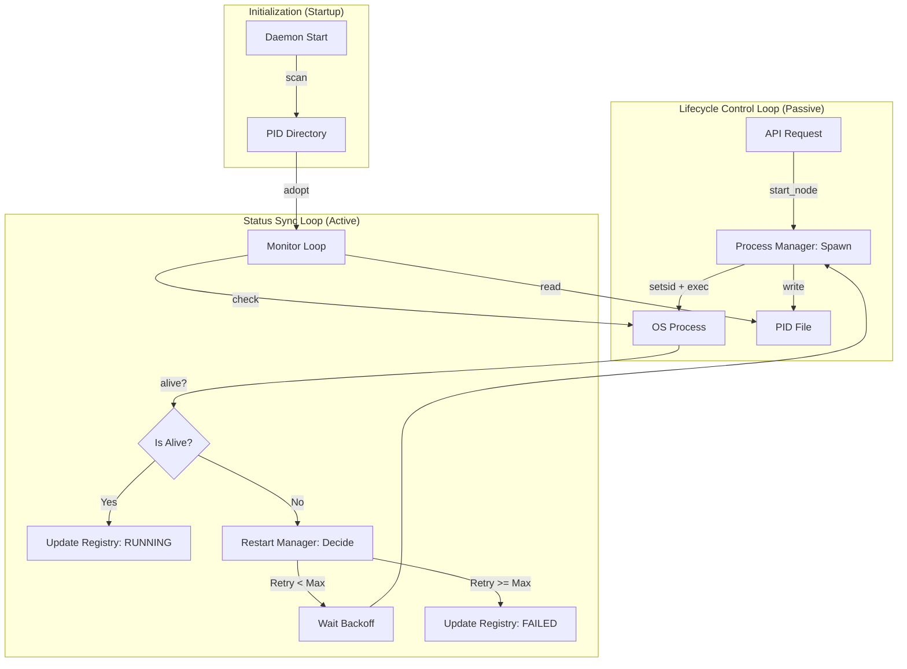

# Mosaic Daemon 架构规范

> **文档用途**: 定义 Mosaic Daemon 的职责、进程管理机制与控制接口  
> **适用范围**: Mosaic 系统的守护进程实现

---

## 1. 核心定义

**Mosaic Daemon** 是 Mesh 实例的**守护者**与**状态权威来源**。

它不直接参与事件的传输或业务处理，其唯一职责是确保 Mesh 网络的基础设施——**Node Runtime Processes**——始终处于健康、可用的状态。

### 1.1 核心职责

1.  **生命周期管理**: 负责启动、停止、重启节点运行时进程。
2.  **健康监控**: 持续监测节点进程的存活状态（PID、僵尸状态）。
3.  **故障恢复**: 根据策略自动拉起崩溃的节点，保证 Mesh 的高可用性。
4.  **状态权威**: 维护节点运行状态的内存视图（NodeRegistry），为 CLI 提供查询接口。

### 1.2 设计原则

*   **弱管辖 (Loose Governance)**: Daemon 虽是父进程，但追求与子进程的生命周期解耦。Daemon 的重启不应影响健康的节点运行。
*   **故障隔离**: Daemon 不加载任何节点业务代码，确保自身的稳定性不受业务故障影响。
*   **幂等操作**: 所有的启动、停止操作都应是幂等的（例如：启动已运行的节点应无副作用）。

---

## 2. 进程管理机制

Daemon 通过以下两个闭环来实现对 Node Runtime Process 的管理：

### 2.1 管理流程图 (Process Management Flow)



### 2.2 生命周期控制环 (Lifecycle Loop)

负责对进程进行物理操作（启动、停止）。

*   **启动 (Spawn)**:
    *   **查找命令**: 根据节点类型查询 **Node Registry**，获取对应的启动命令模板（例如：`python -m mosaic.nodes.agent.cc.main {node_id}`）。
    *   **执行启动**:
        *   使用 `setsid` (start_new_session) 启动进程，确保与 Daemon 终端脱钩。
        *   注入环境变量 (`MOSAIC_MESH_ID`, `MOSAIC_NODE_ID`)。
        *   重定向 `stdout/stderr` 到日志文件 (`~/.mosaic/<mesh>/logs/<node>.log`)。
        *   写入 PID 文件 (`~/.mosaic/<mesh>/pids/<node>.pid`)。

*   **停止 (Terminate)**:
    *   读取 PID 文件。
    *   发送 `SIGTERM` 信号（优雅退出）。
    *   等待超时（默认 10s），若进程仍未退出，发送 `SIGKILL`。
    *   清理 PID 文件。

*   **重启 (Restart)**:
    *   由监控触发。
    *   应用指数退避策略（Exponential Backoff）防止重启风暴。

### 2.3 状态同步环 (Status Sync Loop)

负责感知进程的真实状态，并维护 `NodeRegistry`。

*   **接管 (Adoption)**:
    *   Daemon 启动时，扫描 PID 目录。
    *   对于存在的 PID，检查进程存活。
    *   若存活，直接纳入监控（Status: RUNNING），**不重启**。
    *   若已死（PID 文件残留），清理文件并标记为 FAILED/STOPPED。

*   **监控 (Monitoring)**:
    *   **PID 轮询**: 定期（如 1s）检查 `os.kill(pid, 0)`。
    *   **僵尸检测**: 在 Linux 上读取 `/proc/<pid>/stat` 识别 `Z (Zombie)` 状态，并执行 `waitpid` 收割。

---

## 3. 模块架构

Daemon 模块内部应拆分为以下独立组件，各司其职：

### 3.1 `ProcessManager` (进程管理器)
*   **职责**: 封装所有 OS 级别的进程操作。
*   **接口**:
    *   `spawn(node_id, config) -> pid`
    *   `terminate(pid, force=False)`
    *   `is_alive(pid) -> bool`
*   **特性**: 不包含任何业务策略，只负责“执行命令”。

### 3.2 `NodeRegistry` (节点注册表)
*   **职责**: 维护节点类型到启动配置的映射。
*   **内容**: 代码级配置，定义每种 `node_type` 对应的入口命令、环境变量模板等。
*   **作用**: 解耦 Daemon 与具体节点实现，支持灵活的启动方式。

### 3.3 `Monitor` (监控器)
*   **职责**: 运行后台循环，维护 `NodeRegistry`。
*   **逻辑**:
    *   定期调用 `ProcessManager.is_alive`。
    *   发现状态变更（Running -> Dead）时，通知 `RestartManager`。
    *   维护内存中的节点状态表。

### 3.4 `RestartManager` (恢复管理器)
*   **职责**: 决策层，决定“是否重启”以及“何时重启”。
*   **逻辑**:
    *   读取节点的 `RestartPolicy` (always, on-failure)。
    *   维护重启计数和退避时间。
    *   调用 `ProcessManager.spawn` 执行重启。

### 3.4 `ControlServer` (控制接口)
*   **职责**: 监听 UDS (`daemon.sock`)，处理外部指令。
*   **协议**: JSON-RPC 风格。
*   **命令**:
    *   `start_node(node_id)`
    *   `stop_node(node_id)`
    *   `get_status(node_id)`
    *   `list_nodes()`

---

## 4. 数据结构

### 4.1 NodeRegistry
Daemon 内存中的状态表：

```python
class NodeInfo(BaseModel):
    node_id: str
    pid: Optional[int]
    status: NodeStatus  # RUNNING, STOPPED, FAILED, BACKOFF
    start_time: Optional[datetime]
    crash_count: int
    next_retry_time: Optional[datetime]
```

### 4.2 目录规范
Daemon 依赖文件系统作为持久化状态的辅助：

```
~/.mosaic/<mesh_id>/
├── daemon.pid          # Daemon 自身 PID
├── daemon.sock         # 控制接口 Socket
├── pids/               # 节点 PID 文件目录
│   ├── worker.pid
│   └── supervisor.pid
└── logs/               # 节点日志目录
    ├── worker.log
    └── supervisor.log
```

