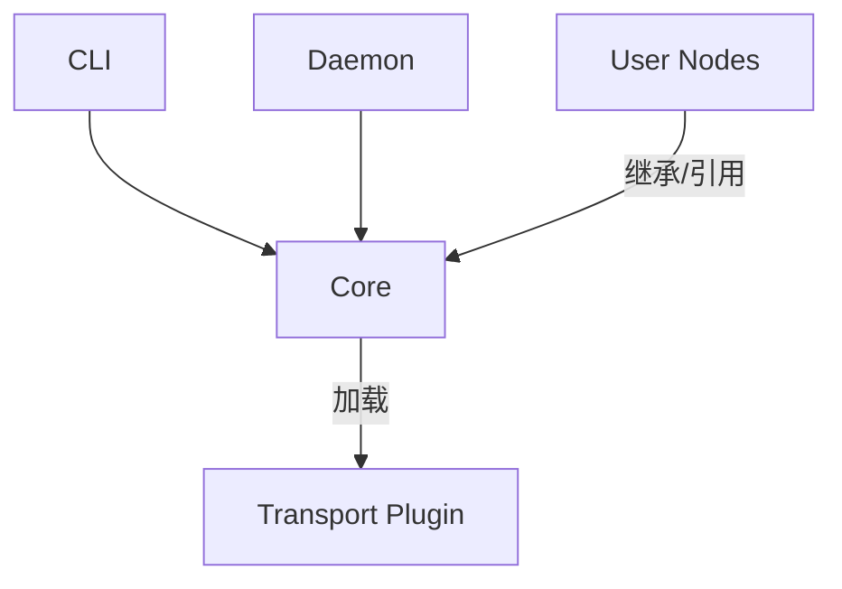

# 模块设计文档

## 1. 模块划分原则

*   **Core 即内核**: 将原有的 `runtime` 逻辑收归 `core`，使其成为能够独立运行的系统骨架。
*   **Core 即契约**: 在 `core` 中集中管理所有标准事件定义和节点能力注册，确保系统的自洽性。
*   **宿主下沉**: 节点启动逻辑内化为 `core.BaseNode` 的一部分。
*   **业务纯净**: 节点实现层 (`nodes`) 只关注业务逻辑，所有系统级交互由基类自动处理。

## 2. 模块详细设计

### 2.1 `mosaic.core` (核心内核)
*   **定位**: 系统的心脏。包含抽象定义、基础模型、标准事件库、能力注册表以及节点的标准运行逻辑。
*   **内容**:
    *   `node.py`: 定义 `BaseNode`。
    *   `events.py`: **[新增] 标准事件定义库** (PreToolUse, etc.)。
    *   `registry.py`: **[增强] 静态能力注册表** (CapabilityRegistry) + 动态元数据管理。
    *   `client.py`: `MeshClient` 实现。
    *   `transport/`: 定义 `TransportBackend` 接口。
    *   `models.py`: 基础数据结构。

### 2.2 `mosaic.transport` (传输插件)
*   **定位**: **I/O 插件**。被 Core 调用，负责比特流的物理传输。
*   **内容**:
    *   `sqlite/`: 默认实现。
        *   `backend.py`: 实现 Core 定义的 `TransportBackend` 接口。
        *   `repository.py`: 负责 `events.db` 的读写。
        *   `signal.py`: 负责 UDS 信号的收发。

### 2.3 `mosaic.nodes` (用户态实现)
*   **定位**: 具体的业务逻辑实现。依赖 Core 的事件定义。
*   **内容**:
    *   `cc/`: Claude Code 智能体节点。
        *   继承 `core.BaseNode`。
        *   生产 `core.events.PreToolUse`。
    *   `scheduler/`: 调度节点。
    *   `webhook/`: Webhook 适配器。

### 2.4 `mosaic.daemon` (运维态)
*   **定位**: OS 进程管理器。
*   **内容**:
    *   `process.py`: 负责执行 Python 命令启动节点进程。
    *   `monitor.py`: 监控 PID 和心跳。

### 2.5 `mosaic.cli` (交互态)
*   **定位**: 命令行工具。
*   **职责**: 
    *   调用 `daemon` 管理进程。
    *   查询 `core.registry` 获取能力定义，校验用户输入。

## 3. 依赖关系图

**关键变化**:
1.  **Core 更加厚重**: 包含了事件定义和能力注册表。
2.  **Nodes 依赖加强**: Nodes 强依赖 Core 中的事件定义，不再自己定义事件。
3.  **CLI 校验能力**: CLI 可以直接从 Core 获取静态能力数据进行校验，无需启动节点。
