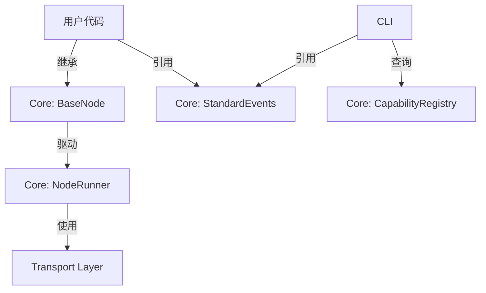

# Core 模块 (Kernel)

## 1. 职责
**Core 是 Mosaic 系统的内核与权威契约**。它不仅提供运行时驱动，还作为系统的**中央注册表**，定义了所有标准事件类型和节点类型的能力契约。

这种"集权"设计确保了系统的高度内聚和自洽，使得开发者仅通过阅读 Core 代码即可掌握系统的语义全貌。

## 2. 架构设计

Core 模块内部实现了**控制反转 (IoC)** 和 **契约驱动 (Contract-Driven)**：
*   **IoC**: Core 提供标准 `BaseNode` 框架，驱动用户代码运行。
*   **Contract**: Core 定义标准事件库和能力注册表，CLI 和 Node 实现都必须遵守此契约。

## 3. 关键组件

### 3.1 BaseNode (节点基类)
所有节点的父类。它包含了厚重的系统逻辑。

*   **定位**: 用户接入系统的唯一入口。
*   **功能**:
    *   `start()`: 启动节点的标准流程。
    *   `_run_forever()`: 封装事件循环。
    *   `_heartbeat()`: 自动维护心跳。
*   **用户接口**:
    *   `process_event(event)`: 核心业务回调。
    *   `send(event)`: 发送事件。

### 3.2 StandardEvents (标准事件库)
系统的通用语言。定义了所有核心事件的 Schema 和语义。

*   `PreToolUse`: 工具调用前（审计核心）。
*   `PostToolUse`: 工具调用后。
*   `UserPrompt`: 用户输入。
*   `SystemInfo`: 系统状态通知。

### 3.3 CapabilityRegistry (能力注册表)
系统的静态知识库。定义了各种**节点类型 (Node Type)** 的能力契约。

*   **数据结构**: 静态字典，映射 `node_type` -> `(produced_events, consumed_events)`。
*   **用途**: 
    *   CLI 在 `create` 和 `sub` 时进行校验。
    *   Runtime 在启动时进行自我检查。

### 3.4 MeshClient (运行时客户端)
节点内部使用的 SDK 对象。
*   持有 `Inbox` 和 `Outbox`。
*   提供 `context` 属性。

## 4. 数据模型 (Models)

*   `MeshEvent`: 标准事件包。
*   `Node`: 节点实例配置。
*   `Subscription`: 订阅关系。
*   `SessionTrace`: 会话上下文。

## 5. 依赖关系
Core 是系统的最底层，包含所有定义。Node 实现层依赖 Core 获取基类和事件定义。
